<div align="center">


</div>

---

<h2 align="center">⚙️ LEONEL DEV CORE</h2>

```bash
╭────────────────────────────────╮
│      LEONEL SYSTEM v1.0        │
╰────────────────────────────────╯

Initializing developer environment...

████████████████████ 100%

✔ Backend engine activated
✔ Java / Spring Boot loaded
✔ REST API layer online
✔ PostgreSQL connected
✔ Docker environment ready
✔ Full Stack mode enabled

STATUS: BUILDING 🚀
```

---

<h2 align="center">👨‍💻 About Me</h2>

```java
public class Leonel {

    String name = "Leonel Zaninelli";
    String role = "Full Stack Developer";
    String focus = "Backend Development";

    String location = "Paraná, Brazil 🇧🇷";

    String[] backend = {
        "Java",
        "Spring Boot",
        "Python",
        "FastAPI",
        "JPA / Hibernate",
        "REST APIs"
    };

    String[] frontend = {
        "React",
        "Next.js",
        "TypeScript",
        "JavaScript",
        "Tailwind CSS"
    };

    String[] database = {
        "PostgreSQL",
        "SQL"
    };

    String[] devOps = {
        "Docker",
        "Git",
        "GitHub",
        "Vercel"
    };

    String mission =
        "Turning real business problems into reliable software ⚙️";
}
```

---

<h2 align="center">💼 Professional Snapshot</h2>

<div align="center">

|                           |                                 |
| ------------------------- | ------------------------------- |
| 💻 **Current Role**       | Full Stack Developer            |
| ⚙️ **Main Focus**         | Backend Development             |
| ☕ **Core Stack**         | Java · Spring Boot · PostgreSQL |
| 🌐 **Full Stack**         | React · TypeScript · Next.js    |
| 🐍 **Also Building With** | Python · FastAPI                |
| 🐳 **DevOps**             | Docker · Git · GitHub · Vercel  |
| 🎓 **Education**          | Software Engineering            |
| 📍 **Location**           | Paraná, Brazil 🇧🇷              |

</div>

<div align="center">

Currently working with **Java/Spring Boot, React, PostgreSQL and Docker**,  
building internal applications, REST APIs and automations.

</div>

---

<h2 align="center">⚡ Tech Stack</h2>

<div align="center">

<h3>Backend</h3>


<br><br>

<h3>Frontend</h3>


<br><br>

<h3>DevOps & Tools</h3>


</div>

---

<h2 align="center">🚀 Featured Projects</h2>

| 🚀 Project | 💡 Description | ⚙️ Stack |
| --- | --- | --- |
| 📚 [Study Manager API](https://github.com/LEONELZANINELLI/study-manager-api) | API for organizing subjects, tasks and study progress | Java |
| 🏦 [Projeto BankJava](https://github.com/LEONELZANINELLI/Projeto-BankJava) | Banking system with accounts, transactions and investments | Java · OOP · Collections · Streams |
| 🌦️ [Clima Fácil](https://github.com/LEONELZANINELLI/clima-facil-streamlit) | Weather application consuming IBGE and Open-Meteo APIs | Python · Streamlit |
| 🤖 [FiscAI / Ideathon Sescap](https://github.com/LEONELZANINELLI/Ideathon-Sescap) | Prototype focused on tax intelligence and Brazilian tax reform | Web · AI |

---

<h2 align="center">🏢 Professional Projects</h2>

### 📄 PGDAS-D Report Automation

Automated workflow for extracting data from PDFs and generating reports.

`Next.js` `TypeScript` `FastAPI` `Python` `Docker`

> PDF processing · report generation · automation · deployment

<br>

### 🧮 Tax Simulator & Business Platform

Development of a responsive institutional platform with tax simulation, tax regime comparison and an internal commercial dashboard.

`React` `JavaScript` `APIs` `Full Stack`

---

<h2 align="center">🏆 Highlights</h2>

| 🏅 Recognition | 🚀 Project |
| --- | --- |
| 🥈 **2nd Place — Ideathon CONECT / Sescap** | FiscAI — Tax Intelligence Platform |
| 🥈 **2nd Place — SmartCities Londrina** | SmartFlow Londrina — AI-powered people flow monitoring |
| 🥉 **3rd Place — GreenTech Hackathon** | Energy Tracker — IoT energy monitoring solution |
| 🎯 **Hackathon Health Tech / Sebrae** | Technology and innovation challenge |

---

<h2 align="center">🧠 Current Mission</h2>

```bash
> Loading current objectives...

[██████████] Java + Spring Boot
[█████████░] REST APIs + PostgreSQL
[████████░░] Full Stack Development
[███████░░░] Docker + DevOps
[██████░░░░] Software Architecture

FOCUS:
Backend Engineering ⚙️

NEXT LEVEL:
Scalable systems, clean architecture and cloud 🚀
```

---

<h2 align="center">📊 GitHub Analytics</h2>

<div align="center">




</div>

---

<h2 align="center">🐍 Contribution Animation</h2>

<div align="center">

<picture>
  <source
    media="(prefers-color-scheme: dark)"
    srcset="https://raw.githubusercontent.com/LEONELZANINELLI/LEONELZANINELLI/output/github-contribution-grid-snake-dark.svg"
  />
  <source
    media="(prefers-color-scheme: light)"
    srcset="https://raw.githubusercontent.com/LEONELZANINELLI/LEONELZANINELLI/output/github-contribution-grid-snake.svg"
  />
  
</picture>

</div>

---

<h2 align="center">🌎 Contact Me</h2>

<div align="center">

<a href="https://github.com/LEONELZANINELLI">
  
</a>

<a href="https://www.linkedin.com/in/leonel-zaninelli-de-souza/">
  
</a>

<br><br>

<h3>⚙️ "Building reliable software, one commit at a time."</h3>


</div>

<br>


