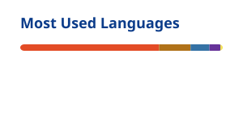

<div align="center">


</div>

---

<h2 align="center">⚙️ LEONEL DEV CORE</h2>

```bash
╭────────────────────────────────╮
│      LEONEL SYSTEM v2.0        │
╰────────────────────────────────╯

Initializing developer environment...

████████████████████ 100%

✔ Backend focus activated
✔ Java / Spring Boot loaded
✔ REST API layer online
✔ PostgreSQL connected
✔ Docker environment ready
✔ Full Stack experience available

STATUS: BUILDING BACKEND SYSTEMS 🚀
```

---

<h2 align="center">👨‍💻 About Me</h2>

<p align="center">
  I'm <b>Leonel Zaninelli</b>, a Software Developer focused on
  <b>Backend Java Development</b>.
</p>

<p align="center">
  I currently work professionally as a <b>Full Stack Developer</b>,
  with most of my focus on backend development using
  <b>Java, Spring Boot, REST APIs, JPA/Hibernate, PostgreSQL and Docker</b>.
</p>

<p align="center">
  When needed, I also work on the frontend with
  <b>React, Vite, HTML, CSS and JavaScript</b>,
  giving me practical experience across the full application lifecycle.
</p>

<p align="center">
  I enjoy turning real business problems into reliable, maintainable
  and automated software solutions.
</p>

<p align="center">
  🎓 Software Engineering Student &nbsp; • &nbsp;
  📍 Paraná, Brazil 🇧🇷
</p>

<div align="center">

`Backend Java` · `Spring Boot` · `REST APIs` · `PostgreSQL` · `Docker` · `Full Stack Experience`

</div>

---

<h2 align="center">💼 Professional Snapshot</h2>

<div align="center">

| | |
| --- | --- |
| 💻 **Current Role** | Full Stack Developer |
| 🎯 **Career Focus** | Backend Java Development |
| ☕ **Core Backend** | Java · Spring Boot · REST APIs · JPA/Hibernate |
| 🗄️ **Database** | PostgreSQL · SQL · Relational Modeling |
| 🌐 **Full Stack Experience** | React · Vite · HTML · CSS · JavaScript |
| 🐍 **Automation & Scripting** | Python · Selenium · Playwright |
| 🐳 **DevOps & Tools** | Docker · Git · GitHub |
| 💡 **Main IDE** | IntelliJ IDEA |
| 🎓 **Education** | Software Engineering |
| 📍 **Location** | Paraná, Brazil 🇧🇷 |

</div>

<p align="center">
  Currently building internal systems, REST APIs and automations,<br>
  with <b>Java/Spring Boot</b> as my main backend stack and
  <b>React</b> when frontend development is required.
</p>

---

<h2 align="center">💼 Professional Experience</h2>

### 🏢 Contabiliza — Full Stack Developer

My current professional role is Full Stack, with a strong emphasis on backend engineering and process automation.

- Backend development with `Java`, `Spring Boot`, `JPA/Hibernate` and `REST APIs`
- PostgreSQL integration, SQL and relational data modeling
- Development of internal systems and process automation
- Development of APIs for NFS-e consultation and management
- Docker-based application deployment and environment standardization
- Frontend development with `React`, `Vite` and `Tailwind CSS` when required
- Version control and collaboration with `Git` and `GitHub`
- Support for internal systems and local infrastructure

> Full Stack experience. Backend direction.

<br>

### 🎓 UniFil — NPI Monitor

Worked as a programming and web development monitor in educational projects.

- Supported more than 50 students
- Practical programming logic activities
- Web development with HTML, CSS and JavaScript
- Support for students from high school and the local community
- Participation in educational technology initiatives

---

<h2 align="center">🧰 Tech Stack</h2>

<div align="center">

<h3>☕ Backend — Main Focus</h3>


<br><br>

`Java` · `Spring Boot` · `REST APIs` · `JPA/Hibernate` · `PostgreSQL` · `SQL`

<br><br>

<h3>🌐 Full Stack Experience</h3>


<br><br>

`React` · `JavaScript` · `Vite` · `Tailwind CSS` · `HTML` · `CSS`

<br><br>

<h3>🐳 DevOps & Tools</h3>


<br><br>

`Docker` · `Git` · `GitHub` · `IntelliJ IDEA`

</div>

---

<h2 align="center">🚀 Featured Projects</h2>

| 🚀 Project | 💡 Description | ⚙️ Stack |
| --- | --- | --- |
| 📚 [Study Manager API](https://github.com/LEONELZANINELLI/study-manager-api) | Backend project for organizing subjects, tasks and study progress | Java |
| 🏦 [Projeto BankJava](https://github.com/LEONELZANINELLI/Projeto-BankJava) | Banking system with accounts, transfers, transactions and investments | Java · OOP · Collections · Streams |
| 🤖 [FiscAI / Ideathon Sescap](https://github.com/LEONELZANINELLI/Ideathon-Sescap) | Tax intelligence prototype focused on the Brazilian tax environment | Web · AI |
| 🌦️ [Clima Fácil](https://github.com/LEONELZANINELLI/clima-facil-streamlit) | Weather application consuming IBGE and Open-Meteo APIs | Python · Streamlit |

---

<h2 align="center">🏗️ Professional Projects</h2>

### 📄 NFS-e Management System

Development of internal systems and backend APIs for NFS-e consultation and management.

`Java` `Spring Boot` `JPA/Hibernate` `PostgreSQL` `REST APIs` `Docker`

Main activities:

- REST API development
- PostgreSQL database integration
- NFS-e consultation and management
- Integration with external fiscal services
- Internal process automation
- Docker deployment
- Application maintenance and evolution

> Backend development · REST APIs · Database integration · Automation · Deployment

<br>

### 📊 PGDAS-D Report Automation

Automated workflow for processing fiscal documents, extracting information and generating reports.

`Python` `FastAPI` `Docker` `Automation`

Main activities:

- PDF processing
- Data extraction
- Report generation
- Workflow automation
- Application deployment

> Automation · Document processing · Reports · Internal productivity

<br>

### 🌐 Full Stack Business Solutions

Development of internal and institutional web interfaces integrated with backend services and business workflows.

`React` `Vite` `JavaScript` `APIs`

Main activities:

- Frontend development
- Backend API integration
- Internal dashboards
- Business process interfaces
- Responsive web applications

> Full Stack experience supporting backend-driven applications

---

<h2 align="center">🏆 Highlights</h2>

| 🏅 Recognition | 🚀 Project |
| --- | --- |
| 🥇 **1st Place — Solveathon CONECT / SESCAP-LDR (2026)** | CrediOn — Tax credit predictability, supplier analysis and cash-flow support |
| 🥈 **2nd Place — Ideathon CONECT / Sescap (2025)** | FiscAI — Tax Intelligence Platform |
| 🥈 **2nd Place — SmartCities Londrina (2025)** | SmartFlow Londrina — AI-powered people flow monitoring |
| 🥉 **3rd Place — GreenTech Hackathon (2026)** | Energy Tracker — IoT energy monitoring solution |

---

<h2 align="center">🎯 Current Mission</h2>

```bash
> Loading current objectives...

[██████████] Java + Spring Boot
[█████████░] REST APIs + PostgreSQL
[████████░░] Docker + Backend Engineering
[███████░░░] Software Architecture
[████░░░░░░] Full Stack / React when needed

FOCUS:
Backend Engineering with Java ⚙️

LEARNING:
Performance · Architecture · Clean Code · Scalability

NEXT LEVEL:
Scalable systems, clean architecture and cloud 🚀
```

---

<h2 align="center">📊 GitHub Analytics</h2>

<div align="center">




</div>

---

<div align="center">

<picture>
  <source
    media="(prefers-color-scheme: dark)"
    srcset="https://raw.githubusercontent.com/LEONELZANINELLI/LEONELZANINELLI/output/github-contribution-grid-snake-dark.svg"
  />
  <source
    media="(prefers-color-scheme: light)"
    srcset="https://raw.githubusercontent.com/LEONELZANINELLI/LEONELZANINELLI/output/github-contribution-grid-snake.svg"
  />
  
</picture>

</div>

---

<h2 align="center">📫 Contact Me</h2>

<div align="center">

<a href="https://github.com/LEONELZANINELLI">
  
</a>

<a href="https://www.linkedin.com/in/leonel-zaninelli-de-souza/">
  
</a>

<br><br>

<h3>⚙️ "Building reliable software, one commit at a time."</h3>


</div>

<br>


